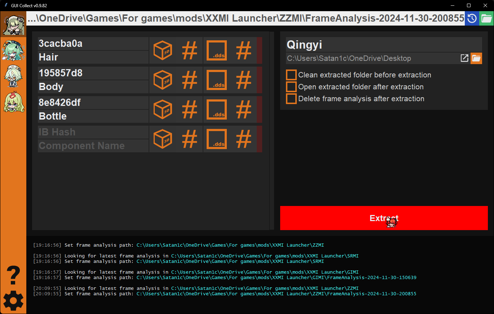
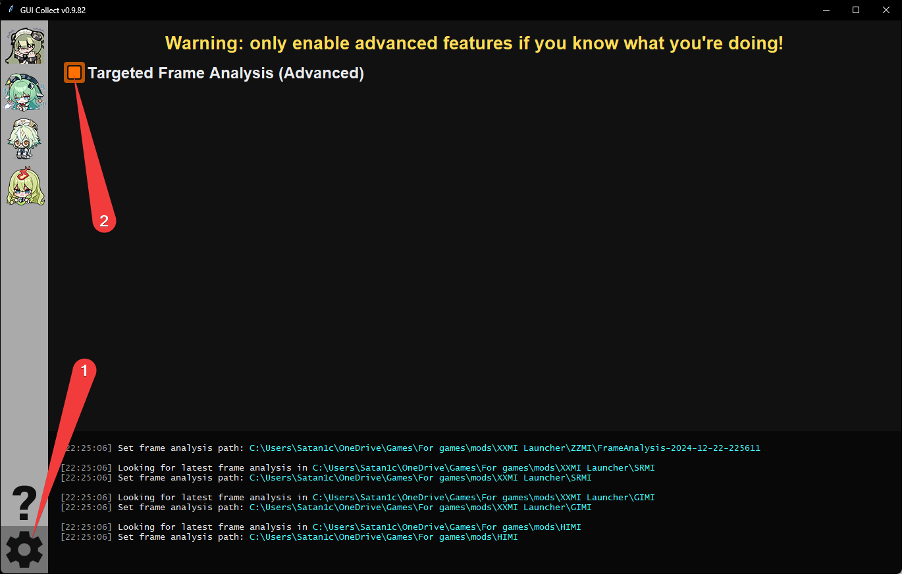

# 3DMigoto Hunting & Dumping Tutorial

> Writen by: Satan1c

This tutorial will go through the process of hunting & dumping.

Learning to hunt for hashes and dump textures or shaders is useful if you want to create your own mod with resources that weren't published or to fix an outdated mod by yourself.

This tutorial will provide a simple description of buffers/shaders and a walkthrough of character hunting & dumping, i.e. finding the correct buffer hashes for a character and dumping the resources for them.

## Prerequisites

You will need the latest versions of [XXMI launcher](getting-started.md) and [gui_collect](https://github.com/Petrascyll/gui_collect) installed.

While hunting, it is recommended to disable all mods. For that, you have to press `F6` in game; however, some mods may remain enabled.
In most cases these will be shader mods, so it is often better to rename the `Mods` folder or add `DISABLED` to it (or whichever is the highest folder with mods that would interfere with the dumping process in it).


## Launcher settings

By default, the ability to enter hunting mode may not be enabled. To enable hunting with XXMI, open settings from the cog wheel in top right of the UI, then go to the appropiate \*\*MI tab for the game you are using and check the "Enable Hunting" setting.
If you need to modify shaders and not just get an updated hash for them, be sure to also enable "Dump Shaders".
Please note that this needs to be done *before* you launch the game with XXMI; if the game is already running and these settings were not enabled, you can either quit the game and enable them then relaunch, or you will need to manually edit the corresponding values in `d3dx.ini`.


## Controls

After the game has been started, if this your first time launching the game with XXMI or you never pressed `F10` after the first time, you will see a popup with usage instructions. If you don't see it, press `F12` to bring it up.
In those instructions it tells you how to view instructions specific to hunting with the hotkey `Ctrl` + `F12`. The hunting-specific instructions contain the default keyboard controls for hunting you will need to use.

All of these controls can be changed in `d3dx.ini` under the `[Hunting]` section with valid [virtual key codes](https://learn.microsoft.com/en-us/windows/win32/inputdev/virtual-key-codes). This is useful if you are not using a keyboard with a numpad and have no access to one.


## Performing the Actions

### Getting hashes

The first thing you need to do is enter hunting mode. By default this is done by pressing `numpad 0`. You should see green text appear on the top and bottom of the screen once you have entered hunting mode.
At the top you will see a section that contains counters for the things we can hunt for. These are:
- `VS` - Vertex Shader
- `PS` - Pixel Shader
- `IB` - Index Buffer
- `VB` - Vertex Buffer
- `CS` - Compute Shader

The numbers after them display `current`/`total count`, that is the index of the current buffer/shader out of the total number for the scene.
The bottom of the screen should always display "Stereo disabled".

The next section you will see comes up only after you have moved forward or backward through one of the above options. It displays the hash that is currently selected for each buffer or shader which can be "marked". If the setting "Dump Shaders" is enabled then it will also save the decompiled/disassembled shader to the `ShaderFixes` folder; "marking" a hash by default only copies the hash value to your system clipboard.


---

### Dumping

Now that we are set up to hunt for the hashes we need, we can move on to dumping the resources for them.
To get an extracted dump -- ready to import into blender -- start gui_collect with launch.bat.
(You should already have this installed and know how to launch it from its own instructions).

After the program has started, you will be met with the screen show in the image just below. The numbered parts of this image are as follows:

1. A button that opens a file chooser. It it used to tell gui_collect the path of the Frame Analysis dumped from the game.
2. This is were you would enter the IB hash copied to your clipboard from hunting.
3. Name of the thing the IB hash is responsible for.
   - Use only ASCII letters and numbers; don't use spaces or non-ASCII symbols.
   - The name is just for your and other modders' reference and does not affect anything for the dumping and extraction process, but they **should be unique**.
   - If the Index Buffer is responsible for the whole object or the majority of it, then it may be blank; in GI there is usually an IB for the body that may be blank.
4. Name of the extraction, usually whatever the whole object is or the character name.
   - As before, use only ASCII letters and numbers; no spaces or non-ASCII symbols.
   - Under the name, you can select where to create the extraction folder.
5. Toggle button that controls whether model data *(ib, buf)* should be analyzed in the dump folder.
6. Toggle button that controls whether model hashes should be included in the resulting `hash.json` file.
7. Toggle button that controls whether textures should be analyzed in the dump folder.
8. Toggle button that controls whether texture hashes should be included in the resulting `hash.json` file.
9. A button that lets you choose from the history of frame dumps that you have done before.
   - Tries to automatically select this value from the chosen MI folder and set it to the last frame dump done.
10. Extract button. It opens a dialog to select assets to be included in extracted dump from selected frame-dump.


---

In order to properly show the dumping process, we will be using dumping Qingyi's model as an example.

:::warning
If you're planning to use the dumped materials to create a mod, it is advised that you do not dump faces, or don't include their hashes/buffers in resulting dump, as currently face modding is not fully supported. Changing the face model will result in it being broken in game (typically by lacking expressions); thus, only the face texture can be modded without any issue at the moment.
:::

When you're hunting for a hash, the object that it belongs to will disappear. This is the default marking method. If you wish to use an alternative method, you can change `marking_mode` in `d3dx.ini`. It contains comments on what the available options are and what they do.


Through the hunting methods discussed earlier, we were able to get the following IB hashes, and paste them into gui_collect:

- `3cacba0a` - Hair
- `195857d8` - Body
- `8e8426df` - Bottle

Once the hashes are copied and pasted into gui_collect, we move on to the next step of performing the dump. To do a frame dump, you need to press `F8` while in hunting mode (i.e. while the green text is on screen). Again, please make sure that no mods which affect your target are enabled while doing this. After you press `F8`, the game will freeze to create the frame dump. Once it's done, select the resulting folder in gui_collect and press extract.



---

Once the Extract dialog comes up, you can select which textures, and texture hashes, will be contained in the extracted dump. There will typically be different formats in different games and between different objects in the same game.

To select the type for each found texture, left click on it and pick from the available list. You need to do this for all of the objects and then click "Done".

A small guide to identifying some types of textures:

- Diffuse
  - A fully colored texture.
- Normal
  - Gradient of only a couple colors; noticeable volume/bump effect.
- Light
  - A simple, colored texture.
- Material
  - A simple, colored texture, with some additional details compared to the LightMap.


---

### Result

The final result once you are done assigning the types to the textures will be another folder with the selected textures and compiled ib/vb0 files ready for import into blender.


## Targeted dump

:::warning
The following section is completely optional
:::

Targeted dumping is a technique to dump only targeted objects instead of the whole scene which allows for a much smaller dump folder size; It will go from gigabytes big to just hundreds of megabytes.

### Targeted dump with gui_collect

If you don't know how to do regular dumps with `gui_collect`, read [that tutorial](../guides/hunting.md) first.

Enable targeted dumping in gui_collect by going to the settings cog wheel in the bottom left corner and selecting the "Targeted Frame Analysis (Advanced)" checkbox.



After enabling that, you will see the following new options above the extract button on the normal page.


1. This field is the location of the ini that will be used for the generated targeting code.
   - it defaults to the one you can find at `gui_collect/include/auto_generated.ini`
   - the file iteself can be completely blank inside
2. The button to generate the above ini and fill with the targeting code.
3. A button to completely clear the generated file (if you are reusing the same file for multiple targeted dumps).

---

To make sure this new ini is loaded by the \*\*MI of the game, you may do one of three things:

1. Add an `include` call in `d3dx.ini` for the generated ini using a path relative to the location of `d3dx.ini`
   - this is not recommended since it will currently be removed every time the game's \*\*MI is updated by XXMI
2. Create an `ini` with overrides for `d3dx.ini`
   - below is an example of what you would put in an ini for that using a relative path
      - with override file located at: `Mods/Etc/d3dx overrides.ini`
      - with generated target-dump ini located at: `XXMI Launcher/gui_collect-main/include/auto_generated.ini`
3. Place a copy of the generated ini somewhere within your `Mods` folder if you did not disable the whole thing
   - you may also set the path of the targeted frame analysis in gui_collect to a file already in this location

```ini
[Include]
include = ..\..\..\gui_collect-main\include\auto_generated.ini
```

Before you generate the ini however, be sure to fill the IB hash sections. Afterwards, once the generated ini file is added somewhere the \*\*MI will be load it, press `F10` to update the configs.

::: info
If you find yourself having to press `F10` a lot while dumping or making a mod, you may encounter a pretty long delay each time. To speed up the load time, if the slowness is due to many shaders being loaded, you can enable the shader cache in `d3dx.ini`.
:::

<!-- 
::: danger
Be aware that doing this may bring about some issues, chief among them being an updated shader but old cache which may cause crashes in rare scenarios.
:::

To enable cache, add that to your overrides ini:

```ini
[Rendering]
cache_shaders = 1
```

--- -->

Now you should see a panel with targeted objects that will be included in the extracted dump.


Press F8, and you're done. As an example of the size reduction, a regular dump on one person's system was 3.4GB, but when doing the targeted dump it became 840MB.
