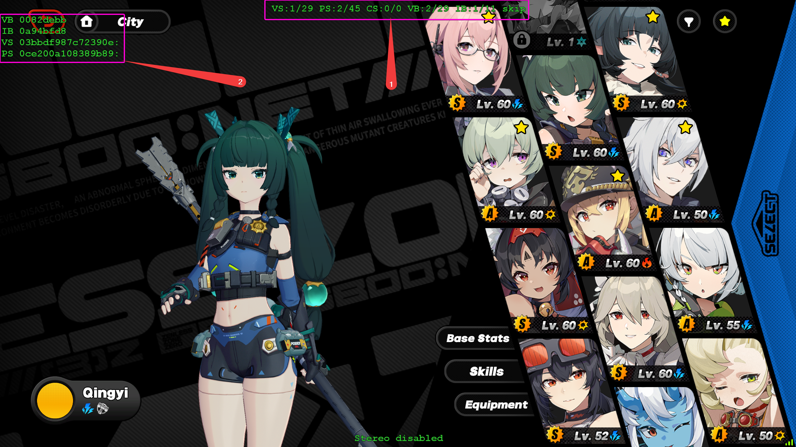

# 3DMigoto Hunting & Dumping Tutorial

> Writen by: Satan1c

This tutorial will go through the process of hunting & dumping.

This is useful if you want to create own mod with resources that wasn't published or outdated,
or to fix outdated mod by yourself.

This tutorial will walk through bare description of buffers/shaders description and example of character hunting & dumping.

## Prerequisites

Have latest [XXMI launcher](getting-started.md) and [gui_collect](https://github.com/Petrascyll/gui_collect) installed.

While hunting, I do recommend to disable all mods, for that, u need to press `F6` however some mods may remain enabled,
in most cases it's shader mods, so better to rename `Mods` folder or add `DISABLED` to the highest folders with mods.

## Launcher settings

By default, mods may not be enabled, to enable them, open settings, then MI tab and enable hunting,
if you need to modify shaders, and not just get fresh hash, enable "Dump Shaders".

## Controls

After game started, on first launch you will see popup with hunting controls, if you don't see it, press `F12`.

All controls can be changed in `d3dx.ini` under `[Hunting]` section, with valid [virtual key codes](https://learn.microsoft.com/en-us/windows/win32/inputdev/virtual-key-codes).

## Action !

### Getting hashes

First of all, make sure hunting is enabled, press `numpad 0`, you should see green text on top and bottom of the screen.

1.Counters section
   - `VS` - Vertex Shader
   - `PS` - Pixel Shader
   - `IB` - Index Buffer
   - `VB` - Vertex Buffer
   - `CS` - Compute Shader

numbers after them displays `current`/`total count`.

2.Hashes

Displays hash that currently marked and can be copied, if was enabled "Dump Shaders" then it will save
shader to `ShaderFixes` folder.

---

### Dumping

To get extracted dump, ready to import into blender, start gui_collect with launch.bat.

After collect started, you will see next interface:
1. Set path to your MI folder.
2. Place for copied from hunting IB hash.
3. Name of what it was.
   - use only letters and numbers, don't use spaces or non ASCII symbols.
   - name won't affect anything, they need for modder and users to understand what part is it,
but they **should be unique**.
   - if IB responsible for whole object or the majority of it, then it may be blank,
in GI there usually IB for body that may be blank.
4. Name for whole object, character name etc.
   - use only letters and numbers, don't use spaces or non ASCII symbols.
   - under name, you can select where to create dumped folder.
5. Model data, indicates if model data *(ib, buf)* will be in dumped folder.
6. Model hashes, indicates if model hashes will be included in resulting `hash.json`.
7. Texture data, indicates if textures will be in dumped folder.
8. Texture hashes, indicates if textures hashes will be included in resulting `hash.json`.
9. Last frame-dump, auto selects from chosen MI folder latest frame-dump folder.
10. Extract, opens dialogue to select assets to include in dump, extracted from selected frame-dump.

---

As example of dumping, I'll dump Qingyi model.
Little warning, if you're planning to use dumped materials to create mod, don't dump faces,
or don't include their hashes/buffers in resulting dump, currently face modding not fully supported,
so if you will change face model it will be broken in mod, only face texture can be modded without any issue.

When you're marking a hash, object that it belongs to will disappear *(default marking method,
as alternative you can change marking_mode in d3dx.ini)*.

I got next hashes, and pasted them into collect:
   - `3cacba0a` - Hair
   - `195857d8` - Body
   - `8e8426df` - Bottle

To make dump, you need to create frame-dump folder by pressing `F8` with `hunting`*(green text)* mode  enabled,
before that, make sure that you disabled mods for target that you want to dump.

After you press `F8`, game will freeze to create frame-dump, after it's done, select last folder and extract.

---

In Extract dialogue you can select which textures, and texture hashes, will be contained in dump.
In different games, and between different object in same game, may be different formats.

To select which texture which type, click in it with LMB, and pick from list.
You need to pick them for all objects, and click "Done".

How to identify textures:
   - Diffuse
      - fully colored texture
   - Normal
      - gradient, noticeable volume/bump effect.
   - Light
      - simple colored texture.
   - Material
      - simple colored texture, with some details.

---

### Result

As result, you will see same folder, with selected textures and compiled ib/vb0 files, to import them into blender.

